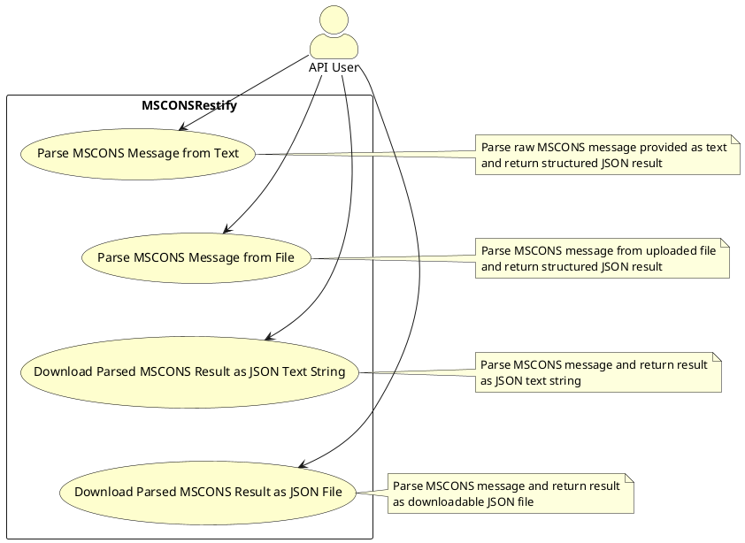
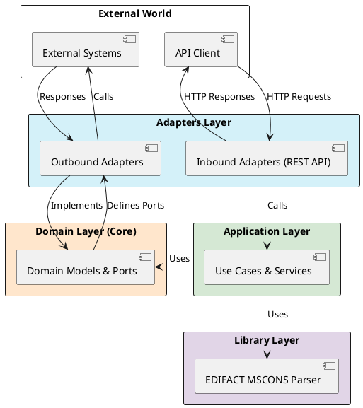
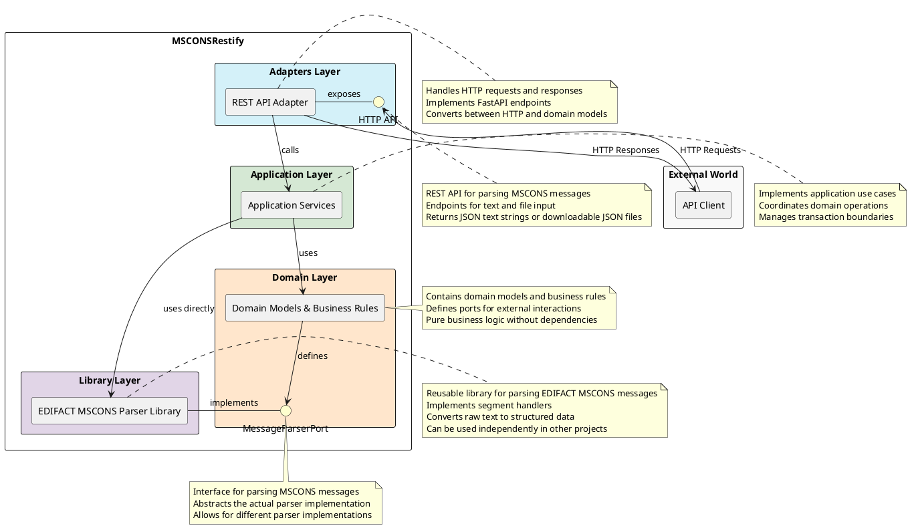
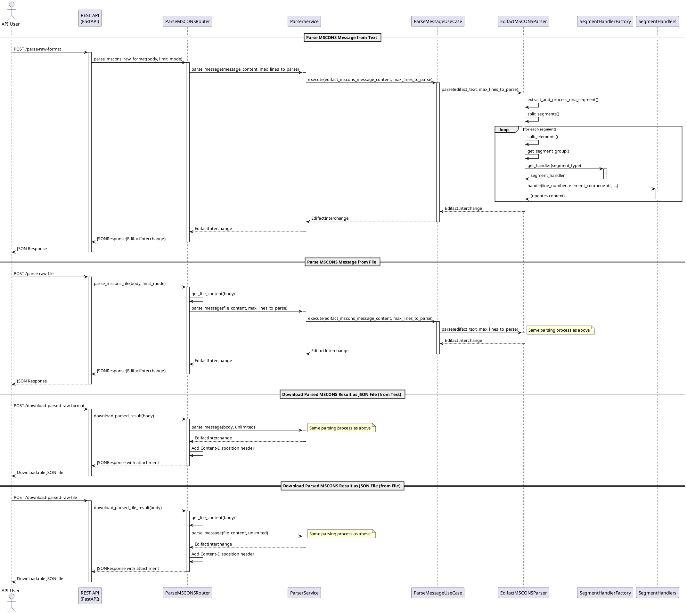
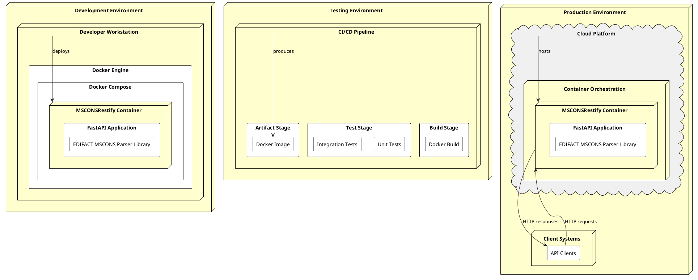

# MSCONSRestify Architecture Documentation

## Table of Contents
1. [Introduction and Goals](#1-introduction-and-goals)
2. [Constraints](#2-constraints)
3. [Context and Scope](#3-context-and-scope)
4. [Solution Strategy](#4-solution-strategy)
5. [Building Block View](#5-building-block-view)
6. [Runtime View](#6-runtime-view)
7. [Deployment View](#7-deployment-view)
8. [Cross-cutting Concepts](#8-cross-cutting-concepts)
9. [Architecture Decisions](#9-architecture-decisions)
10. [Quality Requirements](#10-quality-requirements)
11. [Risks and Technical Debt](#11-risks-and-technical-debt)
12. [Glossary](#12-glossary)

## 1. Introduction and Goals

### 1.1 Requirements Overview

MSCONSRestify is a REST API application for parsing EDIFACT MSCONS messages used in the energy sector (DE/AT/CH) based on version [2.4c](https://bdew-mako.de/linkPdf/9645). The application provides endpoints for:

- Parsing MSCONS messages from text input
- Parsing MSCONS messages from file input
- Downloading parsed MSCONS results as JSON text string
- Downloading parsed MSCONS results as JSON files

### 1.2 Quality Goals

| Priority | Quality Goal    | Scenario                                                                      |
|----------|-----------------|-------------------------------------------------------------------------------|
| 1        | Performance     | The system should parse MSCONS messages efficiently, even for large files     |
| 2        | Usability       | The API should be easy to use with clear documentation                        |
| 3        | Maintainability | The code should follow hexagonal architecture principles for easy maintenance |
| 4        | Reliability     | The system should handle malformed MSCONS messages gracefully                 |

### 1.3 Stakeholders

| Role                    | Expectations                                                                      |
|-------------------------|-----------------------------------------------------------------------------------|
| API Users               | Reliable and fast parsing of MSCONS messages                                      |
| Developers              | Clear documentation and maintainable codebase                                     |
| Energy Sector Companies | Compliance with EDIFACT MSCONS [2.4c](https://bdew-mako.de/linkPdf/9645) standard |

## 2. Constraints

### 2.1 Technical Constraints

- Python 3.9 or higher is required
- FastAPI is used as the web framework
- Docker is used for containerization

### 2.2 Organizational Constraints

- The application must comply with the EDIFACT MSCONS 2.4c standard
- The API must be RESTful

## 3. Context and Scope

### 3.1 Business Context

MSCONSRestify serves as a parser for EDIFACT MSCONS messages, which are used in the energy sector for exchanging metered services consumption reports. The application provides a RESTful API for parsing these messages and returning structured JSON results.

### 3.2 Technical Context

The application is built using Python and FastAPI, with Docker for containerization. It exposes HTTP endpoints for parsing MSCONS messages and returning structured results.

### 3.3 Use Case Diagram

The following diagram shows the main use cases of the application:

## 4. Solution Strategy

The application follows a hexagonal architecture (also known as ports and adapters architecture), which is very similar to clean architecture. This architectural style organizes the application around the domain, with clear boundaries between the domain and external concerns.

The application is structured with the following layers:

- **Domain Layer (Core)**: Contains domain models, business rules, and ports (interfaces)
  - Defines the core business logic and rules
  - Contains interfaces (ports) that define how the domain interacts with the outside world
  - Has no dependencies on other layers or external frameworks

- **Application Layer**: Implements application use cases
  - Orchestrates the flow of data to and from the domain
  - Implements the use cases of the application
  - Depends only on the domain layer

- **Adapters Layer (Infrastructure)**: Contains inbound and outbound adapters
  - **Inbound Adapters**: Implement interfaces defined by the domain to drive the application (e.g., REST API)
  - **Outbound Adapters**: Implement interfaces defined by the domain to interact with external systems

- **Library Layer**: Contains reusable libraries that can be used by other projects
  - **EDIFACT MSCONS Parser**: Implements the parsing functionality as a reusable library

The application uses dependency injection to ensure loose coupling between components and to facilitate testing. This approach allows the domain to remain isolated from external concerns, making it easier to test and maintain.

### 4.1 Hexagonal Architecture Diagram

The following PlantUML diagram illustrates the hexagonal architecture of the application:

This diagram shows how the different layers interact with each other and with the external world. The Domain Layer is at the core, surrounded by the Application Layer, which implements the use cases. The Adapters Layer provides the interfaces to the external world, and the Library Layer contains reusable components like the EDIFACT MSCONS Parser.

## 5. Building Block View

### 5.1 Level 1 - White Box Overall System

The following diagram shows the overall system architecture:

#### 5.1.1 REST API Adapter

The REST API Adapter is responsible for handling HTTP requests and responses. It uses FastAPI to expose endpoints for parsing MSCONS messages and returning structured results, either as JSON text strings or as downloadable JSON files.

#### 5.1.2 Application Services

The Application Services layer implements the application use cases. It coordinates domain operations and manages transaction boundaries.

#### 5.1.3 Domain

The Domain layer contains domain models and business rules. It defines ports for external interactions and contains pure business logic without dependencies.

#### 5.1.4 EDIFACT MSCONS Parser Library

The EDIFACT MSCONS Parser is implemented as a reusable library that can be used by other projects. It is responsible for parsing EDIFACT MSCONS messages, implementing segment handlers, and converting raw text to structured data.

The parser library consists of several key components:
- **Parser**: The main entry point that orchestrates the parsing process
- **Handlers**: Process specific segment types and update the parsing context
- **Converters**: Transform raw segment data into structured context objects
- **Wrappers**: Define the structure of the parsed data (context models)
- **Context**: Maintains state during the parsing process

This library is designed to be independent of the application's use cases, allowing it to be reused in different contexts and projects.

For detailed information about the parsing process, segment types, handlers, converters, and how to extend the parser, see the [MSCONS Parsing Process Documentation](mscons-parsing-process.md).

## 6. Runtime View

### 6.1 Sequence Diagrams

The following diagram shows the interaction between components when parsing MSCONS messages:

## 7. Deployment View

The application is containerized using Docker and can be deployed in various environments:

- Development: Local Docker container
- Testing: CI/CD pipeline with automated tests
- Production: Docker container in a cloud environment

The following diagram illustrates the deployment architecture of the application:

### 7.1 Development Environment

In the development environment, the application is run using Docker Compose on the developer's workstation. The Docker Compose file defines a single service that builds from the Dockerfile using the "service" target. The service exposes port 8000 and runs the application using uvicorn.

### 7.2 Testing Environment

The testing environment is part of a CI/CD pipeline that builds the Docker image, runs tests, and produces an artifact (Docker image) that can be deployed to production. The Dockerfile includes a dedicated test stage that runs the tests using pytest.

### 7.3 Production Environment

In the production environment, the application is deployed as a Docker container in a cloud platform with container orchestration capabilities. The container runs the FastAPI application with the EDIFACT MSCONS Parser library. Clients interact with the application through HTTP requests to the exposed API endpoints.

## 8. Cross-cutting Concepts

### 8.1 Domain Models

The application uses domain models to represent EDIFACT MSCONS messages and their components. These models are defined in the Domain layer and are used throughout the application.

The domain models include representations of MSCONS message structures, segment types, segment groups, and context models. These models are essential for the parsing process and for representing the parsed data in a structured format.

For detailed information about MSCONS message structure, segment types, segment groups, and context models, see the [MSCONS Parsing Process Documentation](mscons-parsing-process.md).

### 8.2 Exception Handling

The application uses custom exceptions to handle errors during parsing. These exceptions are caught and converted to appropriate HTTP responses.

### 8.3 Handlers and Converters

The EDIFACT MSCONS Parser Library uses a system of handlers and converters to process MSCONS messages:

- **Segment Handlers**: Process specific segment types and update the parsing context
- **Segment Converters**: Transform raw segment data into structured context objects
- **Parsing Context**: Maintains state during the parsing process

This approach allows for a modular and extensible parsing system where each segment type is handled by a dedicated handler and converter.

For detailed information about segment handlers, converters, and the parsing context, see the [MSCONS Parsing Process Documentation](mscons-parsing-process.md).

### 8.4 Logging

The application uses Python's logging module to log events and errors. The logging configuration is defined in the infrastructure layer.

## 9. Architecture Decisions

This section documents the key architectural decisions made for the MSCONSRestify project using the Architecture Decision Record (ADR) format. Each decision is presented in a structured format for better readability and maintainability.

### 9.1 Architecture Decision Records (ADRs) Overview

Architecture Decision Records (ADRs) are documents that capture important architectural decisions made along with their context and consequences. The ADR format used in this document includes the following elements:

- **Title/ID**: A unique identifier and descriptive title for the decision
- **Status**: The current status of the decision (proposed, accepted, deprecated, etc.)
- **Date**: When the decision was made
- **Context**: The issue or background that the decision is addressing
- **Decision**: The change being proposed or implemented
- **Rationale**: The reasons behind the decision
- **Implementation**: How the decision was or will be implemented
- **Consequences**: The resulting context after applying the decision (both positive and negative)
- **Alternatives Considered**: Other options that were evaluated
- **Related Decisions**: Links to other ADRs that are related to this decision

| ADR-001: Hexagonal Architecture                                                                                                                                                                                                                                                                                                                                                                                                                                                                                                                                                |
|--------------------------------------------------------------------------------------------------------------------------------------------------------------------------------------------------------------------------------------------------------------------------------------------------------------------------------------------------------------------------------------------------------------------------------------------------------------------------------------------------------------------------------------------------------------------------------|
| **Status:** Accepted                                                                                                                                                                                                                                                                                                                                                                                                                                                                                                                                                           |
| **Date:** 2023-10-01                                                                                                                                                                                                                                                                                                                                                                                                                                                                                                                                                           |
| **Context:**  The application needs an architecture that promotes separation of concerns, testability, and maintainability. The business logic should be isolated from external dependencies to ensure it remains focused on domain concerns.                                                                                                                                                                                                                                                                                                                               |
| **Decision:**  Adopt hexagonal architecture (also known as ports and adapters architecture) for the MSCONSRestify application.                                                                                                                                                                                                                                                                                                                                                                                                                                              |
| **Rationale:**  1. **Domain-Centric Design**: Places the domain at the center, ensuring business logic is not contaminated by external concerns. 2. **Clear Boundaries**: Defines clear boundaries between domain and external systems through ports and adapters. 3. **Testability**: Isolates domain from external dependencies, making it easier to test business logic. 4. **Flexibility**: Allows easy replacement of adapters without affecting the domain. 5. **Maintainability**: Clear separation of concerns makes the codebase easier to understand. |
| **Implementation:**  - **Domain Layer** (`src/msconsparser/domain`): Contains models, business rules, and ports with no external dependencies - **Application Layer** (`src/msconsparser/application`): Implements use cases and services, depends only on domain - **Adapters Layer**: Includes inbound adapters (`adapters/inbound/rest`), infrastructure components, and the EDIFACT parser                                                                                                                                                                        |
| **Consequences:**  - Positive: Improved maintainability, testability, and adaptability to change - Positive: Clear separation between business logic and technical concerns - Negative: Slightly more complex initial setup compared to monolithic approaches - Negative: Requires discipline to maintain the architectural boundaries                                                                                                                                                                                                                             |
| **Alternatives Considered:**  1. **Layered Architecture**: Simpler but less flexible and more prone to coupling 2. **Microservices**: Too complex for the current scope and requirements 3. **Event-Driven Architecture**: Not necessary for the primarily request-response nature of the application                                                                                                                                                                                                                                                                 |
| **Related Decisions:**  - ADR-002: FastAPI as Web Framework - ADR-003: Docker for Containerization                                                                                                                                                                                                                                                                                                                                                                                                                                                                       |

| ADR-002: FastAPI as Web Framework                                                                                                                                                                                                                                                                                                                                                                                           |
|-----------------------------------------------------------------------------------------------------------------------------------------------------------------------------------------------------------------------------------------------------------------------------------------------------------------------------------------------------------------------------------------------------------------------------|
| **Status:** Accepted                                                                                                                                                                                                                                                                                                                                                                                                        |
| **Date:** 2023-10-01                                                                                                                                                                                                                                                                                                                                                                                                        |
| **Context:**  The application requires a web framework that is performant, supports modern Python features, and provides good developer experience.                                                                                                                                                                                                                                                                      |
| **Decision:**  Use FastAPI as the web framework for the REST API implementation.                                                                                                                                                                                                                                                                                                                                         |
| **Rationale:**  1. **Performance**: Built on Starlette and Pydantic, FastAPI offers high performance 2. **OpenAPI Integration**: Automatic generation of OpenAPI documentation 3. **Type Checking**: Leverages Python type hints for validation and editor support 4. **Async Support**: First-class support for asynchronous request handling 5. **Modern Python**: Takes advantage of Python 3.6+ features |
| **Implementation:**  - FastAPI is used in the inbound adapters layer to expose REST endpoints - Pydantic models are used for request/response validation - Automatic OpenAPI documentation is generated for API exploration                                                                                                                                                                                        |
| **Consequences:**  - Positive: Improved developer productivity with automatic documentation - Positive: Better runtime validation through Pydantic - Positive: Good performance characteristics - Negative: Requires Python 3.6+ which may limit deployment options in some environments                                                                                                                        |
| **Alternatives Considered:**  1. **Flask**: Simpler but less performant and lacks built-in async support 2. **Django**: Too heavyweight for the application's needs 3. **Starlette**: Lower-level framework that FastAPI builds upon                                                                                                                                                                               |
| **Related Decisions:**  - ADR-001: Hexagonal Architecture - ADR-003: Docker for Containerization                                                                                                                                                                                                                                                                                                                      |

| ADR-003: Docker for Containerization                                                                                                                                                                                                                                                                                                                                                                                      |
|---------------------------------------------------------------------------------------------------------------------------------------------------------------------------------------------------------------------------------------------------------------------------------------------------------------------------------------------------------------------------------------------------------------------------|
| **Status:** Accepted                                                                                                                                                                                                                                                                                                                                                                                                      |
| **Date:** 2023-10-01                                                                                                                                                                                                                                                                                                                                                                                                      |
| **Context:**  The application needs to be deployed consistently across different environments with minimal configuration differences.                                                                                                                                                                                                                                                                                  |
| **Decision:**  Use Docker for containerization of the MSCONSRestify application.                                                                                                                                                                                                                                                                                                                                       |
| **Rationale:**  1. **Consistency**: Ensures the application runs the same way in all environments 2. **Isolation**: Provides isolation from the host system and other applications 3. **Portability**: Makes it easy to deploy in different environments 4. **Scalability**: Facilitates horizontal scaling when needed 5. **DevOps Integration**: Works well with CI/CD pipelines and orchestration tools |
| **Implementation:**  - A Dockerfile defines the application container - Docker Compose is used for local development and testing - Environment variables are used for configuration                                                                                                                                                                                                                              |
| **Consequences:**  - Positive: Consistent deployment across environments - Positive: Simplified dependency management - Positive: Easier integration with cloud platforms - Negative: Additional complexity in the build and deployment process - Negative: Requires Docker knowledge for development and operations                                                                                       |
| **Alternatives Considered:**  1. **Virtual Environments**: Less isolation and consistency 2. **System Packages**: More difficult to manage across different platforms 3. **Serverless Deployment**: Not suitable for the application's continuous operation model                                                                                                                                                |
| **Related Decisions:**  - ADR-001: Hexagonal Architecture - ADR-002: FastAPI as Web Framework                                                                                                                                                                                                                                                                                                                       |

## 10. Quality Requirements

### 10.1 Performance

The application should be able to parse MSCONS messages efficiently, even for large files. The parsing process is optimized to handle large messages with minimal memory usage.

### 10.2 Usability

The API is designed to be easy to use with clear documentation. The OpenAPI specification provides detailed information about the endpoints and their parameters.

### 10.3 Maintainability

The codebase follows hexagonal architecture principles and is well-documented to ensure easy maintenance.

### 10.4 Reliability

The application handles malformed MSCONS messages gracefully and provides clear error messages.

## 11. Risks and Technical Debt

- The application currently has a limit on the number of lines it can parse (2442 lines by default). This may need to be increased for larger messages. However, this limit was introduced because the Swagger-UI crashed when trying to load large response payloads, particularly for endpoints that return JSON text strings for display in the UI.
- The application does not currently support all EDIFACT message types. Additional segment handlers may need to be implemented.

### 11.1 Extending the Parser Library

The EDIFACT MSCONS Parser is implemented as a reusable library that can be used by other projects. The library is designed to be extensible, allowing developers to add support for new segment types or modify existing behavior.

The parser can be extended to support new segment types by implementing new handlers and converters, creating context models for the new segments, and registering the handlers with the `SegmentHandlerFactory`.

Some segments, like UNA (Service String Advice), require special handling due to their role in defining the syntax of the EDIFACT message.

For detailed information about how to extend the parser and handle special segments, see the [MSCONS Parsing Process Documentation](mscons-parsing-process.md).

## 12. Glossary

| Term    | Definition                                                               |
|---------|--------------------------------------------------------------------------|
| EDIFACT | Electronic Data Interchange for Administration, Commerce and Transport   |
| MSCONS  | Metered Services Consumption Report                                      |
| UNA     | EDIFACT service string advice                                            |
| UNB     | EDIFACT interchange header                                               |
| UNH     | EDIFACT message header                                                   |
| UNT     | EDIFACT message trailer                                                  |
| UNZ     | EDIFACT interchange trailer                                              |
