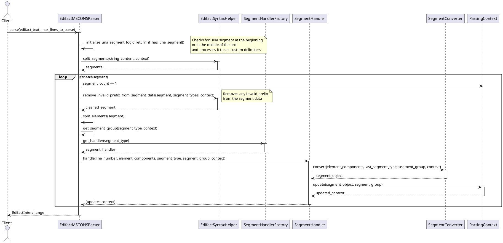

# MSCONS Parsing Process Documentation

## Overview

This document describes the business logic for parsing EDIFACT MSCONS (Metered Services Consumption Report)
messages in the mscons-restify application. The parsing process transforms raw EDIFACT text into structured context
(domain) objects using a system of converters and handlers for each segment type.

EDIFACT (Electronic Data Interchange for Administration, Commerce and Transport) is an international standard for electronic data interchange. MSCONS (Metered Services Consumption Report) is a specific message type within EDIFACT used in the energy sector to exchange consumption data.

This document focuses on the business logic of the parsing process. For information about the overall system architecture,
including the application layers, components, and how the parser fits into the larger system, see the
[Architecture Documentation](architecture.md).

## Parser Architecture

The EDIFACT MSCONS Parser is implemented as a reusable library that can be used by other projects. For information about how the parser fits into the overall system architecture, see the [Architecture Documentation](architecture.md).

The parser library is organized as follows:

1. **Parser**: The main entry point that orchestrates the parsing process
   - **EdifactMSCONSParser**: Implements the parsing logic and manages the parsing context

2. **Handlers**: Process specific segment types and update the parsing context
   - Each segment type has a dedicated handler (e.g., BGMSegmentHandler, UNBSegmentHandler)
   - Handlers are managed by the SegmentHandlerFactory

3. **Converters**: Transform raw segment data into structured context objects
   - Each segment type has a dedicated converter (e.g., BGMSegmentConverter, UNBSegmentConverter)
   - Converters implement the SegmentConverter abstract base class

4. **Wrappers**: Define the structure of the parsed data (context models)
   - Models for interchanges, messages, segment groups, and specific segments
   - Defined in the libs/edifactmsconsparser/wrappers/segments directory

5. **Context**: Maintains state during the parsing process
   - ParsingContext keeps track of the current state of the parsing process
   - Contains references to the current interchange, message, and segment groups

### Flow of the Parsing Process

The following diagram illustrates the flow of the parsing process and the interactions between the different components:



The parsing process follows these steps:

1. The raw EDIFACT text is passed to the `EdifactMSCONSParser.parse()` method
2. The parser initializes segment types from the `SegmentType` enum
3. The parser checks for a UNA segment (Service String Advice) at the beginning or in the middle of the text
   - If a UNA segment is found, it's processed to set custom delimiters
   - The UNA segment is flagged to be skipped during segment processing
4. The parser splits the text into segments using `EdifactSyntaxHelper.split_segments()`
5. For each segment:
   - The segment count in the context is incremented
   - Any invalid prefix is removed from the segment data using `EdifactSyntaxHelper.remove_invalid_prefix_from_segment_data()`
   - The segment type is determined from the first element
   - The segment group is determined based on the segment type and current context
   - A handler for the segment type is retrieved from the `SegmentHandlerFactory`
   - The handler uses its converter to transform the segment data into a context object
   - The handler updates the parsing context with the converted segment
6. The parser returns the completed `EdifactInterchange` object

## EDIFACT Format Structure

### EDIFACT Message Structure

An EDIFACT message is structured as a hierarchical set of segments, each with a specific purpose. The general structure is:

1. **Interchange Level**: Enclosed by UNB (header) and UNZ (trailer) segments
2. **Message Level**: Enclosed by UNH (header) and UNT (trailer) segments
3. **Segment Groups**: Logical groupings of related segments
4. **Segments**: Individual data units like BGM, DTM, NAD, etc.
5. **Elements**: Data elements within segments, separated by the element separator
6. **Components**: Sub-elements within elements, separated by the component separator

Here's an example of a simple MSCONS message:

```
UNA:+.? '
UNB+UNOC:3+4012345678901:14+4012345678901:14+200426:1151+ABC4711++TL++++1'
UNH+1+MSCONS:D:04B:UN:2.4c+UNB_DE0020_nr_1+1:C'
BGM+7+MSI5422+9'
DTM+137:202106011315?+00:303'
RFF+AGI:AFN9523'
DTM+293:20210601060030?+00:304'
NAD+MS+9920455302123::293'
CTA+IC+:P GETTY'
COM+no-reply@example.com:EM'
NAD+MR+4012345678901::9'
UNS+D'
NAD+DP'
LOC+237+11XUENBSOLS----X+11XVNBSOLS-----X'
DTM+163:202102012300?+00:303'
DTM+164:202102022300?+00:303'
LIN+1'
PIA+5+1-1?:1.29.1:SRW'
QTY+220:4250.465:D54'
DTM+163:202101012300?+00:303'
DTM+164:202101312315?+00:303'
QTY+220:4250.465:D54'
DTM+163:202101312315?+00:303'
DTM+164:202101312320?+00:303'
UNT+2+1'
UNZ+1+ABC4711'
```

### EDIFACT Syntax

EDIFACT uses special characters as delimiters to separate different parts of the message:

- **Segment Terminator**: Marks the end of a segment (default: `'`)
- **Element Separator**: Separates elements within a segment (default: `+`)
- **Component Separator**: Separates components within an element (default: `:`)
- **Decimal Mark**: Used for decimal numbers (default: `.`)
- **Release Character**: Escapes special characters (default: `?`)

These delimiters can be customized using the UNA segment at the beginning of the message.

### Segment Types

EDIFACT MSCONS messages consist of various segment types, each with a specific purpose:

- **UNA**: Service String Advice - Defines EDIFACT separators
  - Optional header at the beginning of an EDIFACT message
  - Always exactly 9 characters long
  - Each position has a specific meaning:
    - Position 1-3: Segment tag "UNA"
    - Position 4: Component data element separator (default: ":")
    - Position 5: Data element separator (default: "+")
    - Position 6: Decimal notation mark (default: ".")
    - Position 7: Release character/escape (default: "?")
    - Position 8: Reserved (usually space)
    - Position 9: Segment terminator (default: "'")
  - When present, overrides the default delimiters defined by the EDIFACT standard
  - Example: UNA:+.? '
- **UNB/UNZ**: Interchange Header/Trailer - Encloses the data exchange
- **UNH/UNT**: Message Header/Trailer - Encloses a MSCONS message
- **BGM**: Beginning of Message - Message type/reference
- **DTM**: Date/Time/Period - Date and time information
- **RFF**: Reference - References (e.g., process ID, device number)
- **NAD**: Name and Address - Partner identification or delivery location
- **CTA**: Contact Information - Contact person
- **COM**: Communication Contact - Communication details (phone, email)
- **LOC**: Place/Location Identification - Balance group or object
- **UNS**: Section Control - Separates header and detail sections
- **LIN**: Line Item - Sequential position within the position group
- **PIA**: Additional Product ID - Additional product/device ID
- **QTY**: Quantity - Quantity element (e.g., measured value)
- **CCI**: Composite Code Information - Time series type identification
- **STS**: Status - Status information (plausibility, replacement procedure, etc.)

## Segment Groups

MSCONS messages are organized into segment groups that represent logical sections:

- **SG1**: Contains references (RFF) and date/time information (DTM)
- **SG2**: Contains market partner information (NAD)
- **SG4**: Contains contact information (CTA, COM)
- **SG5**: Contains location information (NAD)
- **SG6**: Contains value and recording information for the object (LOC, DTM, SG7, SG8, SG9)
- **SG7**: Contains reference information (RFF)
- **SG8**: Contains time series type information (CCI)
- **SG9**: Contains position data (LIN, PIA, SG10)
- **SG10**: Contains quantity and status information (QTY, DTM, STS)

## Handlers

Each segment type has a dedicated handler that processes segments of that type. Handlers are responsible for:

1. Validating that the context is appropriate for handling the segment
2. Using a converter to transform the segment data into a context object
3. Updating the parsing context with the converted segment

Handlers are created and managed by the `SegmentHandlerFactory`, which maintains a mapping of segment types to handler instances.

### Handler Architecture

All segment handlers extend the abstract `SegmentHandler` class, which provides common functionality:

```python
from abc import ABC, abstractmethod
from typing import Optional, TypeVar, Generic
from msconsparser.libs.edifactmsconsparser.converters import SegmentConverter
from msconsparser.libs.edifactmsconsparser.wrappers import ParsingContext
from msconsparser.libs.edifactmsconsparser.wrappers.segments import SegmentGroup

T = TypeVar('T')

class SegmentHandler(ABC, Generic[T]):
    """
    Abstract base class for segment handlers.

    This class provides common functionality for all segment handlers, including
    validation, conversion, and context updating. Concrete handlers must implement
    the _update_context method to define how the converted segment updates the
    parsing context.
    """

    def __init__(self, converter: SegmentConverter[T]):
        self._converter = converter

    def handle(self, line_number: int, element_components: list[str], 
               last_segment_type: Optional[str], current_segment_group: Optional[SegmentGroup], 
               context: ParsingContext) -> None:
        """
        Handle a segment by converting it and updating the context.

        This method orchestrates the segment handling process:
        1. Validates the context is appropriate for this segment
        2. Converts the segment data using the converter
        3. Updates the context with the converted segment

        Args:
            line_number: The line number of the segment in the original message
            element_components: The components of the segment
            last_segment_type: The type of the previous segment
            current_segment_group: The current segment group
            context: The parsing context to update
        """
        self._validate_context(context)
        segment = self._converter.convert(
            element_components=element_components,
            last_segment_type=last_segment_type,
            current_segment_group=current_segment_group,
            context=context
        )
        self._update_context(
            segment=segment,
            current_segment_group=current_segment_group,
            context=context
        )

    def _validate_context(self, context: ParsingContext) -> None:
        """
        Validate that the context is appropriate for this handler.

        This method can be overridden by concrete handlers to perform
        segment-specific validation.

        Args:
            context: The parsing context to validate
        """
        pass

    @abstractmethod
    def _update_context(self, segment: T, current_segment_group: Optional[SegmentGroup], 
                       context: ParsingContext) -> None:
        """
        Update the context with the converted segment.

        This method must be implemented by concrete handlers to define how
        the converted segment updates the parsing context.

        Args:
            segment: The converted segment
            current_segment_group: The current segment group
            context: The parsing context to update
        """
        pass
```

### Example: BGM Segment Handler

The `BGMSegmentHandler` processes BGM (Beginning of Message) segments:

```python
from typing import Optional
from msconsparser.libs.edifactmsconsparser.converters import BGMSegmentConverter
from msconsparser.libs.edifactmsconsparser.handlers import SegmentHandler
from msconsparser.libs.edifactmsconsparser.utils import EdifactSyntaxHelper
from msconsparser.libs.edifactmsconsparser.wrappers import ParsingContext
from msconsparser.libs.edifactmsconsparser.wrappers.segments import SegmentGroup, SegmentBGM


class BGMSegmentHandler(SegmentHandler[SegmentBGM]):
    """
    Handler for BGM (Beginning of Message) segments.

    This handler processes BGM segments, which identify the type and function of a message
    and transmit its identifying number. It updates the parsing context with the converted
    BGM segment information.
    """

    def __init__(self, syntax_parser: EdifactSyntaxHelper):
        """
        Initialize the BGM segment handler with the appropriate converter.

        Args:
            syntax_parser: The syntax parser to use for parsing segment components.
        """
        super().__init__(BGMSegmentConverter(syntax_parser=syntax_parser))

    def _update_context(self, segment: SegmentBGM, current_segment_group: Optional[SegmentGroup], context: ParsingContext) -> None:
        """
        Update the context with the converted BGM segment.

        Args:
            segment: The converted BGM segment.
            current_segment_group: The current segment group.
            context: The parsing context to update.
        """
        context.current_message.bgm_beginn_der_nachricht = segment
```

### Handler Registration

Handlers are registered in the `SegmentHandlerFactory` class, which maintains a mapping of segment types to handler instances:

```python
import logging
from typing import Dict, Optional

# Keep this style to avoid circular imports
from msconsparser.libs.edifactmsconsparser.utils.edifact_syntax_helper import EdifactSyntaxHelper

from msconsparser.libs.edifactmsconsparser.wrappers.segments.constants import SegmentType

from msconsparser.libs.edifactmsconsparser.handlers.segment_handler import SegmentHandler
from msconsparser.libs.edifactmsconsparser.handlers.bgm_segment_handler import BGMSegmentHandler
from msconsparser.libs.edifactmsconsparser.handlers.cci_segment_handler import CCISegmentHandler
from msconsparser.libs.edifactmsconsparser.handlers.com_segment_handler import COMSegmentHandler
from msconsparser.libs.edifactmsconsparser.handlers.cta_segment_handler import CTASegmentHandler
from msconsparser.libs.edifactmsconsparser.handlers.dtm_segment_handler import DTMSegmentHandler
from msconsparser.libs.edifactmsconsparser.handlers.lin_segment_handler import LINSegmentHandler
from msconsparser.libs.edifactmsconsparser.handlers.loc_segment_handler import LOCSegmentHandler
from msconsparser.libs.edifactmsconsparser.handlers.nad_segment_handler import NADSegmentHandler
from msconsparser.libs.edifactmsconsparser.handlers.pia_segment_handler import PIASegmentHandler
from msconsparser.libs.edifactmsconsparser.handlers.qty_segment_handler import QTYSegmentHandler
from msconsparser.libs.edifactmsconsparser.handlers.rff_segment_handler import RFFSegmentHandler
from msconsparser.libs.edifactmsconsparser.handlers.sts_segment_handler import STSSegmentHandler
from msconsparser.libs.edifactmsconsparser.handlers.una_segment_handler import UNASegmentHandler
from msconsparser.libs.edifactmsconsparser.handlers.unb_segment_handler import UNBSegmentHandler
from msconsparser.libs.edifactmsconsparser.handlers.unh_segment_handler import UNHSegmentHandler
from msconsparser.libs.edifactmsconsparser.handlers.uns_segment_handler import UNSSegmentHandler
from msconsparser.libs.edifactmsconsparser.handlers.unt_segment_handler import UNTSegmentHandler
from msconsparser.libs.edifactmsconsparser.handlers.unz_segment_handler import UNZSegmentHandler

def __register_handlers(self, syntax_parser: EdifactSyntaxHelper) -> None:
    """
    Initialize and register the handlers dictionary with instances of all segment handlers.
    """
    # Initialize handlers for each segment type
    self.__handlers = {
        SegmentType.UNA: UNASegmentHandler(syntax_parser),
        SegmentType.UNB: UNBSegmentHandler(syntax_parser),
        SegmentType.UNH: UNHSegmentHandler(syntax_parser),
        SegmentType.BGM: BGMSegmentHandler(syntax_parser),
        SegmentType.DTM: DTMSegmentHandler(syntax_parser),
        SegmentType.RFF: RFFSegmentHandler(syntax_parser),
        SegmentType.NAD: NADSegmentHandler(syntax_parser),
        SegmentType.CTA: CTASegmentHandler(syntax_parser),
        SegmentType.COM: COMSegmentHandler(syntax_parser),
        SegmentType.UNS: UNSSegmentHandler(syntax_parser),
        SegmentType.LOC: LOCSegmentHandler(syntax_parser),
        SegmentType.CCI: CCISegmentHandler(syntax_parser),
        SegmentType.LIN: LINSegmentHandler(syntax_parser),
        SegmentType.PIA: PIASegmentHandler(syntax_parser),
        SegmentType.QTY: QTYSegmentHandler(syntax_parser),
        SegmentType.STS: STSSegmentHandler(syntax_parser),
        SegmentType.UNT: UNTSegmentHandler(syntax_parser),
        SegmentType.UNZ: UNZSegmentHandler(syntax_parser),
    }
```

To add a new handler for a segment type, you need to:

1. Create a new handler class that extends `SegmentHandler`
2. Implement the `_update_context` method to define how the segment updates the context
3. Register the handler in the `SegmentHandlerFactory.__register_handlers()` method

## Converters

Converters transform raw segment data into structured context objects. Each segment type has a dedicated converter
that knows how to interpret the segment's components.

### Converter Architecture

Converters implement the `SegmentConverter` abstract base class, which provides:

1. A public `convert()` method that handles exceptions and wraps the internal conversion logic
2. An abstract `_convert_internal()` method that must be implemented by concrete converters
3. A helper method `_get_identifier_name()` for mapping qualifier codes to human-readable names

```python
import logging
from abc import ABC, abstractmethod
from typing import Optional, TypeVar, Generic
from msconsparser.libs.edifactmsconsparser.utils import EdifactSyntaxHelper
from msconsparser.libs.edifactmsconsparser.exceptions import MSCONSParserException
from msconsparser.libs.edifactmsconsparser.wrappers import ParsingContext
from msconsparser.libs.edifactmsconsparser.wrappers.segments import SegmentGroup

logger = logging.getLogger(__name__)
T = TypeVar('T')

class SegmentConverter(ABC, Generic[T]):
    """
    Abstract base class for segment converters.

    This class provides common functionality for all segment converters, including
    exception handling and helper methods. Concrete converters must implement
    the _convert_internal method to define how segment data is transformed into
    a structured object.
    """

    def __init__(self, syntax_parser: EdifactSyntaxHelper):
        """
        Initialize the converter with a syntax parser.

        Args:
            syntax_parser: The syntax parser to use for parsing segment components.
        """
        self._syntax_parser = syntax_parser

    def convert(self, element_components: list[str], last_segment_type: Optional[str],
                current_segment_group: Optional[SegmentGroup], context: ParsingContext) -> T:
        """
        Convert segment components to a structured object.

        This method wraps the internal conversion logic with exception handling.

        Args:
            element_components: The components of the segment
            last_segment_type: The type of the previous segment
            current_segment_group: The current segment group
            context: The parsing context

        Returns:
            The converted segment object

        Raises:
            MSCONSParserException: If an error occurs during conversion
        """
        try:
            return self._convert_internal(
                element_components=element_components,
                last_segment_type=last_segment_type,
                current_segment_group=current_segment_group,
                context=context
            )
        except Exception as e:
            # Handle conversion errors
            raise MSCONSParserException(f"Error converting segment: {e}")

    @abstractmethod
    def _convert_internal(self, element_components: list[str], last_segment_type: Optional[str],
                         current_segment_group: Optional[SegmentGroup], context: ParsingContext) -> T:
        """
        Convert segment components to a structured object.

        This method must be implemented by concrete converters to define how
        segment data is transformed into a structured object.

        Args:
            element_components: The components of the segment
            last_segment_type: The type of the previous segment
            current_segment_group: The current segment group
            context: The parsing context

        Returns:
            The converted segment object
        """
        pass

    def _get_identifier_name(self, qualifier_code: str, current_segment_group: Optional[SegmentGroup]) -> Optional[str]:
        """
        Map a qualifier code to a human-readable name.

        Args:
            qualifier_code: The qualifier code to map
            current_segment_group: The current segment group being processed

        Returns:
            The human-readable name for the qualifier code, or the code itself if not found
        """
        return str(qualifier_code + current_segment_group)
```

### Example: BGM Segment Converter

The `BGMSegmentConverter` transforms BGM segment components into a `SegmentBGM` object:

```python
from typing import Optional
from msconsparser.libs.edifactmsconsparser.converters import SegmentConverter
from msconsparser.libs.edifactmsconsparser.utils import EdifactSyntaxHelper
from msconsparser.libs.edifactmsconsparser.wrappers import ParsingContext
from msconsparser.libs.edifactmsconsparser.wrappers.segments import (
    SegmentGroup, SegmentBGM, DokumentenNachrichtenname, DokumentenNachrichtenIdentifikation)

class BGMSegmentConverter(SegmentConverter[SegmentBGM]):
    """
    Converter for BGM (Beginning of Message) segments.

    This converter transforms BGM segment data from EDIFACT format into a structured
    SegmentBGM object. The BGM segment identifies the type and function of a message
    and transmits its identifying number.
    """

    def __init__(self, syntax_parser: EdifactSyntaxHelper):
        """
        Initialize the BGM segment converter with the syntax parser.

        Args:
            syntax_parser: The syntax parser to use for parsing segment components.
        """
        super().__init__(syntax_parser=syntax_parser)

    def _convert_internal(
            self,
            element_components: list[str],
            last_segment_type: Optional[str],
            current_segment_group: Optional[SegmentGroup],
            context: ParsingContext
    ) -> SegmentBGM:
        """
        Converts BGM (beginning of Message) segment components to a SegmentBGM object.

        The BGM segment identifies the type and function of a message and transmits its identifying number.

        Args:
            element_components: List of segment components
            last_segment_type: The type of the previous segment
            current_segment_group: The current segment group being processed
            context: The context to use for the converter.

        Returns:
            SegmentBGM object with document name, document identification, and message function code

        Example:
        BGM+7+MSI5422+9'
        """
        dokumentenname_code = element_components[1]
        dokumentennummer = element_components[2]
        nachrichtenfunktion_code = element_components[3] if len(element_components) > 3 else None

        return SegmentBGM(
            dokumenten_nachrichtenname=DokumentenNachrichtenname(
                dokumentenname_code=dokumentenname_code
            ),
            dokumenten_nachrichten_identifikation=DokumentenNachrichtenIdentifikation(
                dokumentennummer=dokumentennummer
            ),
            nachrichtenfunktion_code=nachrichtenfunktion_code
        )
```

### Creating a New Converter

To create a new converter for a segment type:

1. Create a new converter class that extends `SegmentConverter` with the appropriate type parameter
2. Implement the `_convert_internal` method to transform the segment data into a structured object
3. Use the converter in a corresponding handler

For example, to create a converter for a new segment type "XYZ":

```python
from typing import Optional
from msconsparser.libs.edifactmsconsparser.converters import SegmentConverter
from msconsparser.libs.edifactmsconsparser.utils import EdifactSyntaxHelper
from msconsparser.libs.edifactmsconsparser.wrappers import ParsingContext

class XYZSegmentConverter(SegmentConverter[SegmentXYZ]):
    def __init__(self, syntax_parser: EdifactSyntaxHelper):
        super().__init__(syntax_parser=syntax_parser)

    def _convert_internal(
            self,
            element_components: list[str],
            last_segment_type: Optional[str],
            current_segment_group: Optional[SegmentGroup],
            context: ParsingContext
    ) -> SegmentXYZ:
        # Extract data from element_components
        data1 = element_components[1]
        data2 = element_components[2] if len(element_components) > 2 else None

        # Create and return a structured object
        return SegmentXYZ(
            data1=data1,
            data2=data2
        )
```

## Parsing Context

The `ParsingContext` maintains state during the parsing process. It serves as a container for the current state of the parsing operation and is updated by handlers as each segment is processed.

### Context Structure

The `ParsingContext` contains:

1. An `EdifactInterchange` object that represents the entire parsed interchange
2. References to the current message and various segment groups (SG1-SG10)
3. A segment counter (actually, each line from the message file represents a segment)
4. A method to reset the context for a new message

```python
from typing import Optional
from msconsparser.libs.edifactmsconsparser.wrappers.segments.message_structure import (
EdifactInterchange, EdifactMSconsMessage
)
from msconsparser.libs.edifactmsconsparser.wrappers.segments.segment_group import (
    SegmentGroup1, SegmentGroup2, SegmentGroup4, SegmentGroup5,
    SegmentGroup6, SegmentGroup7, SegmentGroup8, SegmentGroup9, SegmentGroup10
)

class ParsingContext:
    """
    The context that yields all relevant intermittent states during the parsing process.

    This class maintains references to the current interchange, message, and segment groups
    being processed during the parsing of an MSCONS message. It allows the parser to
    build the message structure incrementally as segments are encountered in the input.

    According to the MSCONS D.04B 2.4c standard, messages have a hierarchical structure
    with segment groups that can be nested. This context helps track the current position
    in this hierarchy during parsing.
    """

    def __init__(self):
        """
        Initialize a new parsing context.

        Creates an empty interchange and initializes all current segment group references to None.
        Also initializes the segment counter to 0.
        """
        self.interchange = EdifactInterchange()
        self.current_message: Optional[EdifactMSconsMessage] = None
        self.current_sg1: Optional[SegmentGroup1] = None
        self.current_sg2: Optional[SegmentGroup2] = None
        self.current_sg4: Optional[SegmentGroup4] = None
        self.current_sg5: Optional[SegmentGroup5] = None
        self.current_sg6: Optional[SegmentGroup6] = None
        self.current_sg7: Optional[SegmentGroup7] = None
        self.current_sg8: Optional[SegmentGroup8] = None
        self.current_sg9: Optional[SegmentGroup9] = None
        self.current_sg10: Optional[SegmentGroup10] = None
        self.segment_count = 0  # Segment counter for the interchange file

    def reset_for_new_message(self):
        """
        Reset the context for a new message.

        This method is called when a new message is started (typically when a UNH segment
        is encountered). It resets all current segment group references to None.

        According to the MSCONS D.04B 2.4c standard, each message starts with a UNH segment
        and has its own hierarchy of segment groups, so the context needs to be reset
        for each new message.
        """
        self.current_message: Optional[EdifactMSconsMessage] = None
        self.current_sg1: Optional[SegmentGroup1] = None
        self.current_sg2: Optional[SegmentGroup2] = None
        self.current_sg4: Optional[SegmentGroup4] = None
        self.current_sg5: Optional[SegmentGroup5] = None
        self.current_sg6: Optional[SegmentGroup6] = None
        self.current_sg7: Optional[SegmentGroup7] = None
        self.current_sg8: Optional[SegmentGroup8] = None
        self.current_sg9: Optional[SegmentGroup9] = None
        self.current_sg10: Optional[SegmentGroup10] = None
```

### Context Lifecycle

The context is created when the parser is initialized and is updated throughout the parsing process:

1. **Initialization**: The context is initialized with an empty interchange and all segment group references set to None
2. **UNA Segment**: If a UNA segment is found, the context's interchange is updated with the custom delimiters
3. **UNB Segment**: The context's interchange is updated with the interchange header information
4. **UNH Segment**: A new message is created and added to the interchange, and the context is reset for the new message
5. **Other Segments**: The context is updated according to the segment type and the current segment group
6. **UNT Segment**: The message is finalized and the context's current message is set to None
7. **UNZ Segment**: The interchange is finalized

### Context Updates

Each segment handler is responsible for updating the context with the converted segment. For example:

- The `UNBSegmentHandler` updates the context's interchange with the interchange header information
- The `UNHSegmentHandler` creates a new message, adds it to the interchange, and resets the context for the new message
- The `BGMSegmentHandler` updates the context's current message with the BGM segment information
- The `NADSegmentHandler` updates the context's current segment group with the NAD segment information

The context is gradually built up as each segment is processed, resulting in a complete parsed data structure.

## Context Models

The parsed data is structured according to context models defined in the `libs/edifactmsconsparser/wrappers/segments` directory:

1. `interchange.py`: Models for the interchange and basic segments
2. `message.py` and `message_structure.py`: Models for messages and message structures
3. `segment_group.py`: Models for segment groups
4. Other files like `location.py`, `measurement.py`, `partner.py`, `reference.py`: Models for specific MSCONS segments

These models define the structure of the parsed data and are populated by the segment handlers during the parsing process.

## Extending the Parser

The EDIFACT MSCONS Parser is designed to be extensible, allowing developers to add support for new segment types or modify existing behavior. For information about the parser's role in the overall system architecture, see the [Architecture Documentation](architecture.md).

### Adding Support for a New Segment Type

To extend the parser to support a new segment type, follow these steps:

1. **Define the segment type constant**:
   Add the new segment type to `libs/edifactmsconsparser/wrappers/segments/constants.py`:
   ```python
   class SegmentType:
       # Existing segment types...
       XYZ = "XYZ"  # Your new segment type
   ```

2. **Create a context model for the segment**:
   Create a new class in one of the files in `libs/edifactmsconsparser/wrappers/segments/` (e.g., `message.py`, `interchange.py`):
   ```python
   from typing import Optional
   
   class SegmentXYZ:
       """
       XYZ segment - Your segment description
       """
       data1: str
       data2: Optional[str] = None
   ```

3. **Export the new model**:
   Add the new model to `libs/edifactmsconsparser/wrappers/segments/__init__.py`:
   ```python
   from msconsparser.libs.edifactmsconsparser.wrappers.segments.message import SegmentXYZ

   __all__ = [
       # Existing exports...
       "SegmentXYZ",
   ]
   ```

4. **Implement a converter for the segment**:
   Create a new converter in the `libs/edifactmsconsparser/converters` directory:
   ```python
   from typing import Optional
   from msconsparser.libs.edifactmsconsparser.converters import SegmentConverter
   from msconsparser.libs.edifactmsconsparser.utils import EdifactSyntaxHelper
   from msconsparser.libs.edifactmsconsparser.wrappers import ParsingContext
   from msconsparser.libs.edifactmsconsparser.wrappers.segments import SegmentGroup
   
   class XYZSegmentConverter(SegmentConverter[SegmentXYZ]):
       def __init__(self, syntax_parser: EdifactSyntaxHelper):
           super().__init__(syntax_parser=syntax_parser)

       def _convert_internal(
               self,
               element_components: list[str],
               last_segment_type: Optional[str],
               current_segment_group: Optional[SegmentGroup],
               context: ParsingContext
       ) -> SegmentXYZ:
           # Extract data from element_components
           data1 = element_components[1]
           data2 = element_components[2] if len(element_components) > 2 else None

           # Create and return a structured object
           return SegmentXYZ(
               data1=data1,
               data2=data2
           )
   ```

5. **Implement a handler for the segment**:
   Create a new handler in the `libs/edifactmsconsparser/handlers` directory:
   ```python
   from typing import Optional

   from msconsparser.libs.edifactmsconsparser.handlers import SegmentHandler
   from msconsparser.libs.edifactmsconsparser.utils import EdifactSyntaxHelper
   from msconsparser.libs.edifactmsconsparser.wrappers import ParsingContext
   from msconsparser.libs.edifactmsconsparser.wrappers.segments import SegmentGroup

   class XYZSegmentHandler(SegmentHandler[SegmentXYZ]):
       def __init__(self, syntax_parser: EdifactSyntaxHelper):
           super().__init__(XYZSegmentConverter(syntax_parser=syntax_parser))

       def _update_context(self, segment: SegmentXYZ, current_segment_group: Optional[SegmentGroup],
                          context: ParsingContext) -> None:
           # Update the context with the segment
           # This depends on where the segment belongs in the message structure
           if current_segment_group == SegmentGroup.SG1:
               context.current_sg1.xyz_segment = segment
           elif current_segment_group == SegmentGroup.SG2:
               context.current_sg2.xyz_segment = segment
           # Add more cases as needed
   ```

6. **Register the handler**:
   Add the new handler to `SegmentHandlerFactory.__register_handlers()` in `libs/edifactmsconsparser/handlers/segment_handler_factory.py`:
   ```python
   from msconsparser.libs.edifactmsconsparser.wrappers.segments import SegmentType
   from msconsparser.libs.edifactmsconsparser.utils import EdifactSyntaxHelper
   
   def __register_handlers(self, syntax_parser: EdifactSyntaxHelper) -> None:
       # Initialize handlers for each segment type
       self.__handlers = {
           # Existing handlers...
           SegmentType.XYZ: XYZSegmentHandler(syntax_parser),
       }
   ```

7. **Update segment group determination**:
   If the new segment affects segment group determination, update the `get_segment_group()` method in `EdifactMSCONSParser` in `libs/edifactmsconsparser/edifact_mscons_parser.py`:
   ```python
   from typing import Optional
   from msconsparser.libs.edifactmsconsparser.wrappers.segments import SegmentGroup, SegmentType

   @staticmethod
   def get_segment_group(
           current_segment_type: str,
           current_segment_group: Optional[SegmentGroup],
   ) -> Optional[SegmentGroup]:
       # Existing logic...

       if current_segment_type.startswith(SegmentType.XYZ):
           # Determine the segment group for XYZ segments
           if current_segment_group == SegmentGroup.SG1:
               return SegmentGroup.SG1
           if current_segment_group == SegmentGroup.SG2:
               return SegmentGroup.SG2
           # Add more cases as needed

       # Existing logic...
   ```

8. **Add tests**:
   Create tests for the new converter and handler in the `tests/msconsparser/libs/edifactmsconsparser/converters` and `tests/msconsparser/libs/edifactmsconsparser/handlers` directories.

### Modifying Existing Behavior

To modify the behavior of an existing segment type:

1. **Modify the converter**:
   Update the `_convert_internal` method of the segment's converter to change how the segment data is transformed.

2. **Modify the handler**:
   Update the `_update_context` method of the segment's handler to change how the context is updated.

3. **Update tests**:
   Update the tests for the modified converter and handler to verify the new behavior.

### Handling Special Segments

Some segments, like UNA (Service String Advice), require special handling:

1. **UNA Segment**: The UNA segment defines the delimiters used in the EDIFACT message and must be processed before any other segments.
   - The parser checks for a UNA segment at the beginning of the file or somewhere in the middle of the text before splitting the text into segments
   - If found, it processes the UNA segment to set custom delimiters and flags it to be skipped during segment processing
   - The UNA segment handler updates the parsing context’s UNA segment based on the custom delimiters defined in the UNA segment itself
   - This ensures that all subsequent segments are parsed correctly using the custom delimiters

2. **Invalid Prefixes**: The parser can handle segments with invalid prefixes.
   - For each segment, the parser checks if it starts with a valid segment type
   - If not, it looks for a valid segment type within the segment data
   - If found, it removes the invalid prefix and logs a warning
   - This allows the parser to handle malformed EDIFACT messages that may have been corrupted or modified

For segments that require special handling:

1. Implement the special handling logic in the `parse()` method of `EdifactMSCONSParser`
2. Ensure that the segment handler updates any necessary global state (e.g., delimiters)
3. Add appropriate tests to verify the special handling logic

### Example: Special Handling for UNA Segment

```python
from typing import Optional
from msconsparser.libs.edifactmsconsparser.wrappers.segments import SegmentType
from msconsparser.libs.edifactmsconsparser.wrappers.segments.constants import EdifactConstants

logger = logging.getLogger(__name__)
   
def __initialize_una_segment_logic_return_if_has_una_segment(self, edifact_text: str) -> bool:
    una_segment: Optional[str] = None
    # Check for the UNA segment at the beginning of the text
    if edifact_text.startswith(SegmentType.UNA):
        una_segment = edifact_text[:EdifactConstants.UNA_SEGMENT_MAX_LENGTH]
    else:
        # Check for UNA segment is somewhere in the middle of the text
        index = edifact_text.find(SegmentType.UNA)
        if index > 0:
            logger.warning(f"Removing invalid prefix from UNA segment '{edifact_text[:index]}'")
            una_segment = edifact_text[index:EdifactConstants.UNA_SEGMENT_MAX_LENGTH]

    if una_segment:
        # Process the UNA segment to set the delimiters
        una_handler = self.__handler_factory.get_handler(SegmentType.UNA)
        if una_handler:
            una_handler.handle(
                line_number=1,
                element_components=[una_segment],
                last_segment_type=None,
                current_segment_group=None,
                context=self.__context
            )
    return una_segment is not None
```

## Error Handling and Validation

The parser includes robust error handling and validation to ensure that MSCONS messages are parsed correctly and that errors are reported clearly.

### Exception Handling

The parser uses a custom exception class `MSCONSParserException` for reporting parsing errors:

```python
from typing import Optional

class MSCONSParserException(Exception):
    """
    Exception raised for errors during MSCONS parsing.

    This exception is used to report errors that occur during the parsing process,
    such as invalid syntax, missing required elements, or context validation failures.
    """

    def __init__(self, message: str, details: Optional[str] = None):
        """
        Initialize the exception with a message and optional details.

        Args:
            message: The error message
            details: Optional additional details about the error
        """
        self.message = message
        self.details = details
        super().__init__(f"{message}: {details}" if details else message)
```

Exceptions are handled at different levels:

1. **Converter Level**: The `SegmentConverter.convert()` method catches exceptions during conversion and wraps them in a `MSCONSParserException` with additional context.
2. **Handler Level**: The `SegmentHandler.handle()` method catches exceptions during handling and adds information about the segment being processed.
3. **Parser Level**: The `EdifactMSCONSParser.parse()` method catches exceptions during parsing and adds information about the line being processed.

### Validation

Validation occurs at several points in the parsing process:

1. **Input Validation**: The parser validates that the input text is not None.
2. **Line Limit Validation**: The parser validates that the number of lines does not exceed the specified limit.
3. **Segment Validation**: Each segment handler can validate that the context is appropriate for handling the segment.
4. **Element Validation**: Converters validate that the required elements are present and have the correct format.

### Common Errors and Solutions

Here are some common errors that may occur during parsing and how to resolve them:

1. **"No valid parsing input"**: Ensure that the input text is not None or empty.
2. **"Maximum number of segments reached"**: Increase the `max_lines_to_parse` parameter or set it to -1 for unlimited parsing.
3. **"Error converting segment"**: Check that the segment format matches the expected format for that segment type.
4. **"No Handler for segment type X defined"**: Implement a handler for the missing segment type or check that the segment type is correct.
5. **"Invalid segment format"**: Check that the segment follows the EDIFACT syntax rules and has the correct delimiters.

## Testing and Debugging

### Unit Testing

The parser includes comprehensive unit tests for each component:

1. **Parser Tests**: Test the overall parsing process with different inputs.
2. **Handler Tests**: Test each segment handler's ability to update the context correctly.
3. **Converter Tests**: Test each segment converter's ability to transform segment data correctly.
4. **Syntax Helper Tests**: Test the syntax helper's ability to split segments and elements correctly.

To run the tests:

```bash
python -m unittest discover tests/msconsparser/libs/edifactmsconsparser
```

### Debugging Tips

When debugging parsing issues:

1. **Enable Logging**: Set the logging level to DEBUG to see detailed information about the parsing process.
2. **Check the Input**: Verify that the input EDIFACT message is well-formed and follows the expected format.
3. **Inspect the Context**: Add breakpoints or logging statements to inspect the parsing context at different stages.
4. **Test with Simplified Messages**: Start with a simple message and gradually add complexity to isolate issues.
5. **Check Segment Handlers**: Verify that the appropriate handler is being called for each segment type.

## Troubleshooting

### Common Issues

1. **Parser crashes with large messages**: 
   - Increase the `max_lines_to_parse` parameter or set it to -1 for unlimited parsing.
   - Consider processing the message in chunks if memory is an issue.

2. **Segment not recognized**: 
   - Check that the segment type is defined in `SegmentType`.
   - Verify that a handler is registered for the segment type in `SegmentHandlerFactory`.

3. **Incorrect segment group determination**: 
   - Check the `get_segment_group()` method in `EdifactMSCONSParser` to ensure it correctly determines the segment group for the segment type.

4. **Custom delimiters not recognized**: 
   - Verify that the UNA segment is present in the message (it can be at the beginning or in the middle).
   - Check that the UNA segment handler correctly updates the context with the custom delimiters.

5. **Missing or incorrect data in the parsed result**: 
   - Check the converter for the segment type to ensure it correctly extracts all required data.
   - Verify that the handler correctly updates the context with the converted segment.

### Performance Considerations

1. **Memory Usage**: The parser builds a complete in-memory representation of the MSCONS message, which can be memory-intensive for large messages.
2. **Processing Time**: The parser processes each segment sequentially, which can be time-consuming for large messages.
3. **Line Limit**: The parser has a configurable line limit to prevent processing very large messages that could cause memory issues.

## Conclusion

The MSCONS parsing process in this application follows a clean, modular design with clear separation of concerns.
The use of dedicated handlers and converters for each segment type makes the code maintainable and extensible,
allowing for easy addition of new segment types or modification of existing behavior.

The parser includes robust error handling and validation to ensure that MSCONS messages are parsed correctly and that errors are reported clearly. The comprehensive test suite helps ensure that the parser works correctly and that changes don't introduce regressions.

This document has focused on the business logic of the parsing process. For information about how the parser
fits into the overall system architecture, including the application layers, components, and deployment,
see the [Architecture Documentation](architecture.md).
